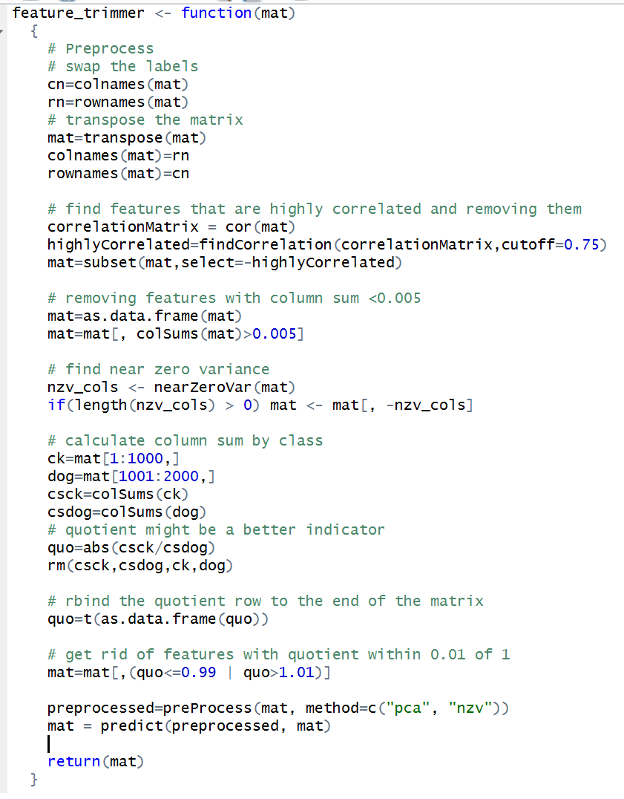
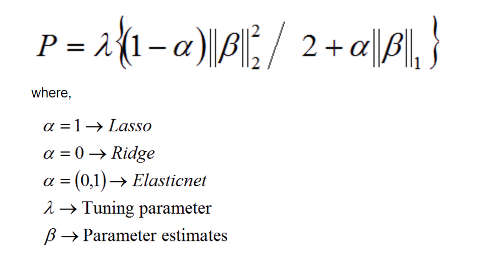

Check for installed packages 

```{r, include=False}
rm(list=ls())
#R.version
#if your R version is not 3.3.3(2017-03-06), before you proceed, update it first by running:
install.packages("installr")
installr::install.R()

packages.used=c("plyr","glmnet","gbm","RSNNS","e1071","caret")

# check packages that need to be installed.
packages.needed=setdiff(packages.used, 
                        intersect(installed.packages()[,1], 
                                  packages.used))
# install additional packages
if(length(packages.needed)>0){
  install.packages(packages.needed, dependencies = TRUE)
}

if(!require("EBImage")){
  source("https://bioconductor.org/biocLite.R")
  biocLite("EBImage")
}

library("EBImage")
library("gbm")
library("glmnet")
library(RSNNS)
library(e1071)
library(caret)

source("../lib/feature_selection.r")
source("../lib/test.R")
source("../lib/train.R")
```

### Step 1: import training images class labels

```{r train_label}

######################################################################
## Data Preparation ##
Fea = read.csv("../data/sift_features/sift_features.csv",as.is = T, header = T)
Fea = t(Fea) #the features as column, data object as row

# for randomForest to use classification unstead of regression,
# we need to factorize y
y = read.csv("../data/labels.csv",as.is = T) #0 for chicken(not a dog), 1 for dog

```


### Step 2: Our baseline


```{r}
######################################################################

ptm = proc.time()
nzv_cols <- nearZeroVar(Fea)
if(length(nzv_cols) > 0) baseline_features <- Fea[, -nzv_cols]
    
Data = cbind(y,baseline_features)
Data = as.data.frame(Data)
# change colnames
names = c("y",paste0("Fea",1:(length(Data)-1)))
colnames(Data) = names

## divide train-test(80%-20%)
set.seed(200)
index = sample(1:2000,1600)
Train = Data[index,]
Test = Data[-index,]
baseline_features_time = proc.time() -ptm

######################################################################

#start the clock
ptm <- proc.time()
## PS. this version of ADABOOST needs response to be {0,1}
b = gbm(y~.,data = Train,
        distribution = "adaboost",
        n.trees = 1200,
        shrinkage=0.01,
        interaction.depth = 1, # stump
        bag.fraction = 0.8,
        train.fraction = 1,
        cv.folds=5,
        keep.data = TRUE,
        verbose = "CV")
best_iter = gbm.perf(b, method="cv", plot=FALSE)
# Stop the clock
baseline_training_time = proc.time() - ptm #228 sec
######################################################################
##predict time
ptm <- proc.time()
y_adj = ifelse(unlist(y)==0,-1,1)
f.predict = predict(b,Train,best_iter)
train_rate = mean(sign(f.predict)!= y_adj[index]) #0.195
t.predict = predict(b,Test,best_iter)
test_rate = mean(sign(t.predict)!= y_adj[-index]) #0.255
baseline_prediction_time = proc.time() - ptm # 12 sec
######################################################################
baseline_train = 1-train_rate
baseline_test = 1 - test_rate
cat(paste("Baseline Train Accuracy: ", baseline_train, "\n", "Baseline Test Accuracy", baseline_test))

```


### Step 3: Our exploration

Feature selection without models.



Passive Aggressive Classifer: 


We also had a gradient boosting tree in Python, with an accuracy around 75% for test and 80% for train.


### Step 4: Feature selection and extraction

We used LASSO regression coefficients to select the features for the MLP model.

Here, P is the penalty for the parameters.




```{r}
ptm = proc.time()
feature_selection_mlp(Fea,y)
feature_selection_mlp_time = proc.time() - ptm

ptm = proc.time()
feature_selection_svm(Fea,y)
feature_selection_svm_time = proc.time() - ptm

```


### Step 5: Train a classification model with training dataset

Model 1: Multilayer perceptron.
mlp_tune returns a matrix of training and testing accuracy, size, or number of hidden layer(s), and maxit, or maximum number of iterations to learn.
```{r loadlib}
Train_mlp=read.csv("../data/Train_nn.csv")
Test_mlp=read.csv("../data/Test_nn.csv")

set.seed(129)
ptm = proc.time()
result_mlp=mlp_tune(Train_mlp, Test_mlp)
mlp_tune_time = proc.time() - ptm

View(result_mlp)
```


MLP result.
```{r runcv, message=FALSE, warning=FALSE}

ptm = proc.time()
MLP=mlp_train(size=27, maxit=17, Train = Train_mlp)
mlp_train_time = proc.time() - ptm

ptm = proc.time()
pred_mlp=mlp_test(MLP, Test = Test_mlp, Train = Train_mlp)
mlp_predict_time = proc.time() - ptm


```


Visualize cross-validation results for MLP. 

As you can probably see, testing accuracy is negatively affected by the differences between training and testing, since training will usually be higher than testing. Interestingly, testing accuracy is also positively related to training accuracy--the better the training accuracy, the better the testing accuracy tends to be. Moreover, to increase testing accuracy, one can look to increase the number of iteration; though, blindly increasing iteration could result in overfitting.
```{r cv_vis}
cor(result_mlp)
plot(result_mlp$size, result_mlp$testAcc)
plot(result_mlp$iteration, result_mlp$testAcc)
```


Now we introduce another classifier: the support vector machine.


First we tune the parameter like before.
```{r}
Train_svm=read.csv("../data/Train_svm.csv")
Test_svm=read.csv("../data/Test_svm.csv")

ptm = proc.time()
result_svm=svm_tune(Train_svm, Test_svm)
svm_tune_time = ptm = proc.time() - ptm

View(result_svm)
```


Using the best tuned parameters, we train the model and give predictions.
```{r}
ptm = proc.time()
SVM= svm_train(cost=0.0015, Train = Train_svm)
svm_train_time = ptm = proc.time() - ptm

ptm = proc.time()
pred_svm = svm_test(SVM, Test = Test_svm, Train = Train_svm)
svm_predict_time = ptm = proc.time() - ptm
```

Visualize cross-validation results for SVM. 

As you can probably see, there is a high correlation between testing accuracy and cost. Surprisingly, the correlation between testing accuracy and differences is not negative. In this case, worst models have a smaller difference between testing and training accuracy, whereas models with good testing accuracy have even better training accuracy. 

```{r cv_vis}
cor(result_svm)
plot(result_svm$cost, result_svm$testAcc)
```


### Summarize Running Time
Prediction performance matters, so does the running times for constructing features and for training the model, especially when the computation resource is limited. 
```{r running_time}
cat("Time for constructing baseline features = ", baseline_features_time[3]/60, "minutes \n")
cat("Time for training baseline = ", baseline_training_time[3]/60, "minutes \n")
cat("Time for constructing MLP features = ", feature_selection_mlp_time[3]/60, "minutes \n")
cat("Time for tuning MLP model = ", mlp_tune_time[3]/60, "minutes \n")
cat("Time for training MLP model = ", mlp_train_time[3]/60, "minutes \n")
cat("Time for predicting with MLP model = ", mlp_predict_time[3]/60, "minutes \n")
cat("Time for constructing SVM features = ", feature_selection_svm_time[3]/60, "minutes \n")
cat("Time for tuning SVM model = ", svm_tune_time[3]/60, "minutes \n")
cat("Time for training SVM model = ", svm_train_time[3]/60, "minutes \n")
cat("Time for predicting with SVM model = ", svm_predict_time[3]/60, "minutes \n")
```
